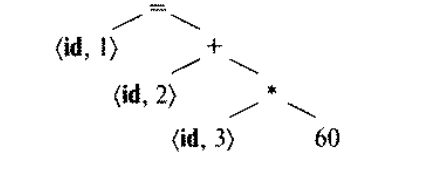
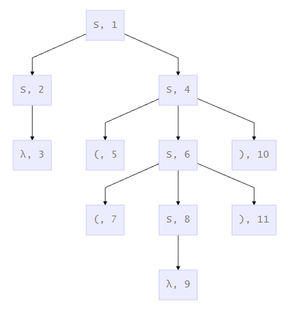
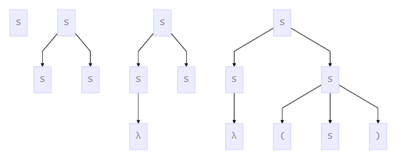
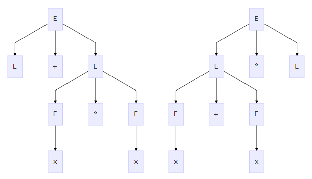
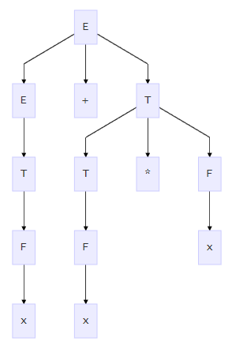

*February 19, 2019*

Рассмотрим анализ строки `pos = init + rate * 60;` компилятором

1. **Лексический анализ**
   В угловых скобках записываются токены, язык на этой стадии состоит только из токенов

   ```pascal
   <id,1> <=> <id,2> <+> <id,3> <*> <const> <;>, где <id, i> - ссылка на таблицу символов
   ```

2. **Синтаксический анализ**
   Построение синтаксического дерева

   

3. **Семантический анализ**
   Строится семантическое дерево, внешне почти не отличающееся от синтаксического.
   Важной частью семантического анализа является ***проверка типов***. При необходимости и допустимости происходит ***приведение типов***.

4. **Промежуточное представление**

   ```pascal
   t1 = rate * 60;
   t2 = init + t1;
   pos = t2;
   ```

Заметим, что на каждой стадии возникает какой-то свой язык, а в следствии чего и распознаватель

> Грамматика используется как наиболее универсальный способ описания языков


## Иерархия Хомского-Шютцеберже

0. **Грамматика общего вида**
    *Распознаватель: МТ (Машина Тьюринга)*
    *Класс языков: RecEn (Рекурсивно-перечислимые)*

1. **КЗ-грамматика**
   *Распознаватель: LBA (Линейно-ограниченные автоматы)*
   *Класс языков: КЗЯ*

   > Контекстно-зависимая грамматика (КЗГ) - грамматика, сохраняющая контекст, т.е. 
   > $$
   > \alpha A\beta \rightarrow \alpha \gamma \beta
   > $$

   > **Язык обладает свойством $P$, если $\exist$ грамматика $G$ со свойством $P$, его порождающая**
   > *Например, быть контекстно-зависимым*

2. **КC-грамматика**
   *Распознаватель: НМПА (PDA) - недетерминированные автоматы с магазинной памятью*
   *Класс языков: КСЯ*

   > Контекстно- свободная грамматика (КСГ) - частный случай КЗГ
   > $$
   > A\rightarrow \beta
   > $$

   > *Пример*. Кажется, что это грамматика обычного вида.
   >
   > $S \rightarrow ABS|\lambda$
   > $AB \rightarrow BA$
   > $A \rightarrow a$
   > $B \rightarrow b$
   > $S \rightarrow SS|a|b|\lambda$
   >
   > Построим КСГ, которая породит язык выше. Порождаем цепочки, где букв $b$ на одну больше, чем $a$
   >
   > Из $А$ должны выводиться строчки, где на одну $a$ больше
   >
   > $S \rightarrow aB|bA$
   > $A \rightarrow aS|bAA$
   > $B\rightarrow bS|aBB$
   > $A \rightarrow a$
   > $B \rightarrow b$
   >
   > $abba : \:S \rightarrow aB \rightarrow abS \rightarrow abbA \rightarrow abba $

3. **Праволинейная грамматика**
   *Распознаватель: ДКА*
   *Класс языков: регулярные*

   > Праволинейная грамматика
   > $$
   > A \rightarrow aB\\
   > A \rightarrow \lambda
   > $$

___

**регулярные языки ⊂ КСЯ ⊂ КЗЯ ⊂ Rec ⊂ RecEn**

___


## КС грамматики и языки (КСГ и КСЯ)

**Упорядоченное дерево** - дерево, на узлах которого задан порядок со следующими свойствами:

1. если $x$ - сын $y$, то $x \geqslant y$
2. если $x$ и $y$ братья и $x\leqslant y$, то для всех сыновей $z$ узла $x$ $z \leqslant y$

*Можно заметить, что образуется естественный порядок для обхода в глубину слева направо*

> *Пример (грамматический язык скобочный выражений):*
> $$
> S \rightarrow SS|(S)|\lambda\\
> S\rightarrow SS\rightarrow S\rightarrow(S) \rightarrow((S))\rightarrow S
> $$
> Дерево выводы
>
> 
>
> В узле в формате `<label>, <number>` указаны метка и номер данного узла

**Дерево вывода цепочки $w$ в грамматике $G=<\Sigma, \Gamma, P, S>$** - упорядоченное дерево со следующими свойствами:

1. узлы, помечены не термами, корень - аксиомой, листья - термы или $\lambda$, причём у листьев, помеченных $\lambda$ нет братьев
2. если у узла $x​$ все сыновья $y_1 \leqslant y_2 \leqslant ... \leqslant y_n​$ и узлы $x, y_1, y_2, ..., y_n​$ помечены символами $X​$ и $Y​$, то $(X \rightarrow Y_1, ..., Y_n) \in P​$
3. если все листья дерева имеют метки $a_1 \leqslant a_2 \leqslant ...  \leqslant a_n$, то $w=a_1...a_n$

Вывод цепочки $w​$ $(S\Rightarrow \alpha_1 \Rightarrow \alpha_2  \Rightarrow ...  \Rightarrow \alpha_n=w)​$ в $G=<\Sigma, \Gamma, P, S>​$ деревом вывода $T​$, если существует набор *стандартных поддеревьев $T_1, ..., T_n​$* на упорядоченных листьях дерева $T_i​$ 

**Стандартное поддерево $T'$ дерева $T$** является поддерево $T'$ дерева $T$, если

1. корень $T'$ - корень $T$
2. если узел $x$ дерева $T \in T'$, то либо $x$ - лист, либо все сыновья $x$ в $T \in T'$ 

> Стандартные поддеревья для нашего примера
> 
> 
> 
> Последовательно расположены стандартные поддеревья $T_1, T_2, T_3, T_4​$

Рассмотрим грамматику $E \rightarrow E+E|E*E|(E)|x​$, где $x​$ - не конкретное значение, токен операнда

Рассмотрим возможные деревья вывода



Грамматика **однозначна**, если $w$ выводится в грамматике и $\exist!$ дерево выводы.

Рассмотрим грамматику
$E \rightarrow E+T|T$
$T \rightarrow T*F|F$
$F \rightarrow (E)|x$

Она эквивалента вышепредставленной грамматике, но не является ***однозначной***
Её дерево выглядит следующим образом



Выводы:

1. $E \rightarrow E+T \rightarrow E+T*F \rightarrow E+T*x\rightarrow E+F*x \rightarrow E+x*x \rightarrow T+x*x \rightarrow F+x*x \\ \rightarrow x+x*x$
   *правосторонний вывод*, т.к. всегда раскрывается правый

1. $E \rightarrow E+T \rightarrow T+T \rightarrow F+T \rightarrow x+T \rightarrow x+T*F \rightarrow x+F*F \rightarrow x+x*F \rightarrow x+x*x$
   *левосторонний вывод*

и т.д.

Очевидно, что выводов достаточно много (помимо правостороннего и левостороннего), а дерево вывода одно и то же!

***$l$-форма*** и ***$r$-форма***  соответствуют левостороннему и правостороннему выводам